<p align="center">
  
</p>

<h1 align="center">HiddenIndexEngine</h1>

<p align="center">
  <b>Open source engine and visual editor for Hidden Object Games.</b><br>
  Build once in Python, ship to Windows, the web and Android.
</p>

<p align="center">
  <a href="https://github.com/indecenti/HiddenIndexEngine/actions/workflows/ci.yml"></a>
  <a href="LICENSE"></a>
  <a href="LICENSE-ASSETS.md"></a>
  <a href="https://www.python.org/"></a>
  <a href="https://www.pygame.org/"></a>
</p>

<p align="center">
  <a href="#try-it">Try it</a> &nbsp;·&nbsp;
  <a href="#the-editor">Editor</a> &nbsp;·&nbsp;
  <a href="#one-project-three-targets">Export</a> &nbsp;·&nbsp;
  <a href="#scenes-and-minigames">Scenes</a> &nbsp;·&nbsp;
  <a href="#documentation">Docs</a> &nbsp;·&nbsp;
  <a href="#license">License</a>
</p>

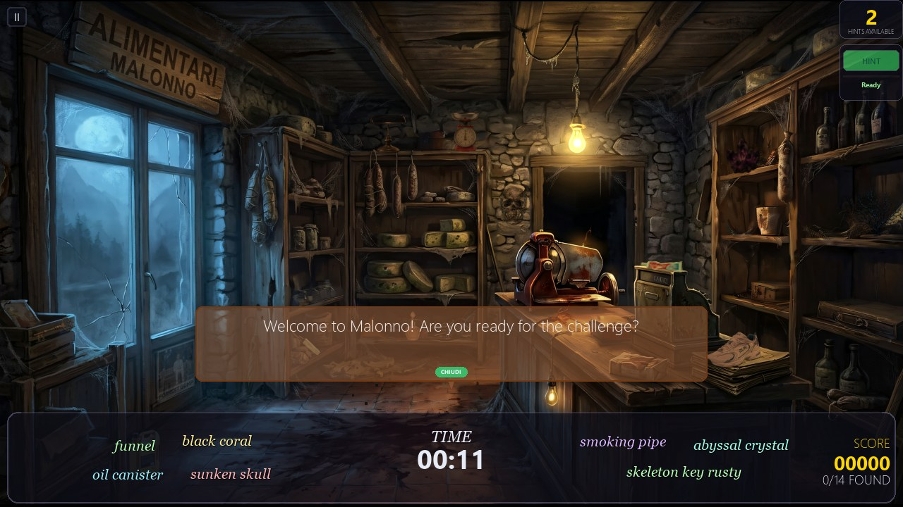

*Malonno Survivors, Formis scene, desktop runtime: welcome bubble, 14 objects to find,
hints, timer and score. The same scene, from the same `scene.json`, also runs in the web
export and in the Android APK.*

## Highlights

- **Visual editor** — scenes, objects, catalog, tags, translations and builds from a single
  window. No hand-written JSON.
- **Three targets, one project** — Windows EXE, static HTML5 site, Android APK/AAB. Each
  is one click from the project browser.
- **Camouflage-aware auto-scatter** — places objects where they actually blend in, scoring
  the rendered result in Lab color space instead of scattering at random.
- **Replayable scenes** — every run redraws which objects count as goals, and can swap the
  whole object layer, so the same scene never plays the same way twice.
- **Three catalog styles** — photoreal, line art and cartoon, over 1,600 objects ready to
  place, filtered by style and tag.
- **Plugin minigames** — sudoku, spot the differences, asteroids, centipede, tetran, tower,
  pong, slot machine, arcade. Add your own without touching the core.
- **Hints, speech bubbles, HUD, save games, results screen** — all included and themed
  (default, horror, kids, mystery, cyber neon skins).
- **Five languages** — it, en, es, fr, de. Strings are harvested automatically when a scene
  is saved.

Status: pre-1.0, evolving fast. Desktop tested on Windows 10/11; Android validated on the
emulator. **Every contribution is welcome**: bug reports, scenes, assets, translations,
minigames, docs, code. See [Contributing](#contributing).

## Try it

Requires **Python 3.12** on Windows 10/11.

```bash
git clone https://github.com/indecenti/HiddenIndexEngine.git
cd HiddenIndexEngine
python -m venv .venv
.venv\Scripts\activate
pip install -r requirements.txt
```

```bash
python main.py                                        # demo game (Malonno Survivors)
python main.py --scene Welcome_To_Malonno/Villa_Rosa  # jump straight into one scene
python main.py --minigame sudoku                      # run a minigame
python run_editor.py                                  # level editor
```

For tests and builds: `pip install -r requirements-dev.txt`, then `pytest`.

## The editor

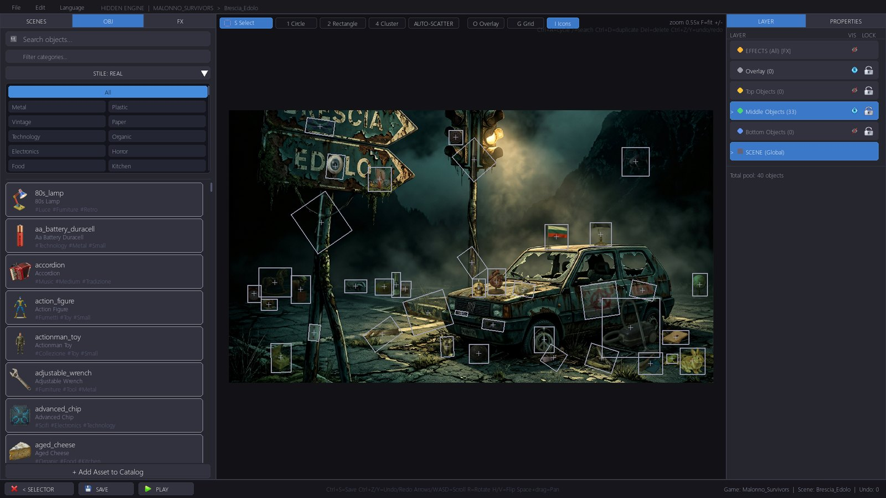

*Object catalog with tag filters on the left, layers and scene properties on the right,
auto-scatter and detection tools in the toolbar. Every object is a `catalog_id` plus a
detection shape: click to place, drag to move, save to `scene.json`.*

### Scene outline

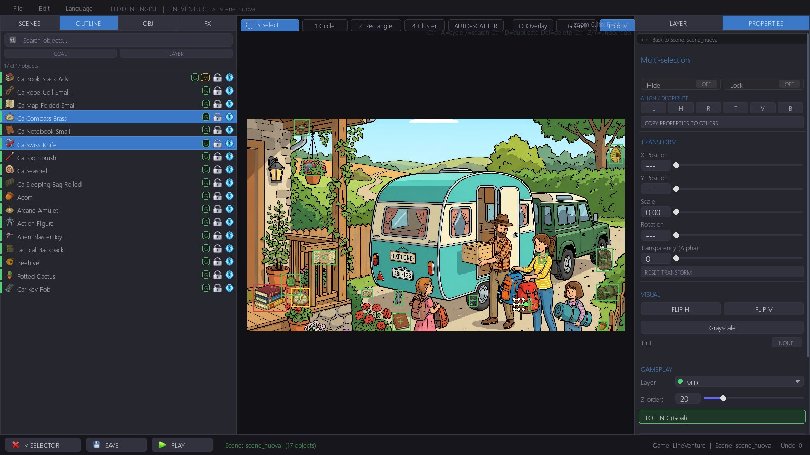

*The Outline tab lists every object placed in the scene with its layer, goal and minigame
badges. Search or filter to find one, click to select and bring it into view, double click
to frame it, ctrl/shift for a multi-selection - the properties panel then edits the whole
selection at once. The eye and lock buttons hide or freeze objects in the editor only.*

### Replayable scenes

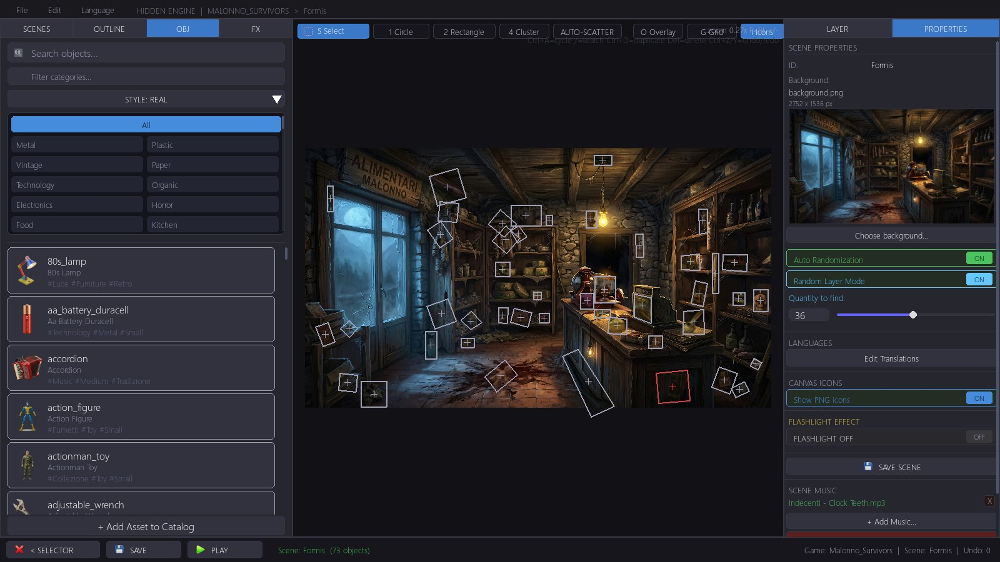

*Two scene switches keep a scene worth replaying. **Auto Randomization** rotates the
objects to find: the scene keeps its full pool of placed objects and every run draws
`Quantity to find` of them as goals, so the same background asks for a different list each
time (objects marked as always shown stay in every run). **Random Layer Mode** rotates the
layers: each run loads only one of the three interchangeable object layers - low, mid,
high - so one background can hold three alternative sets, while overlay and fixed layers
are always kept. Both are replicated in the JS runtime, so the EXE, the web build and the
APK behave the same.*

### One editor, three art styles

| Line art | Cartoon |
|:---:|:---:|
| 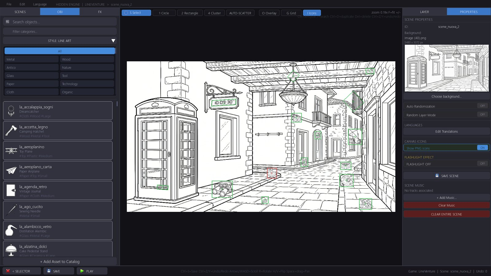 | 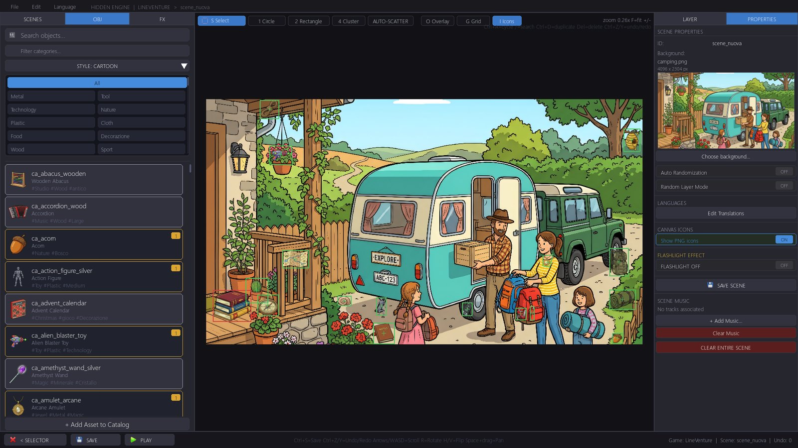 |

*The catalog switches style with the scene. The properties panel handles background,
randomization, translations, flashlight effect and scene music.*

### Projects and assets

| Project browser | Background and tag library |
|:---:|:---:|
| 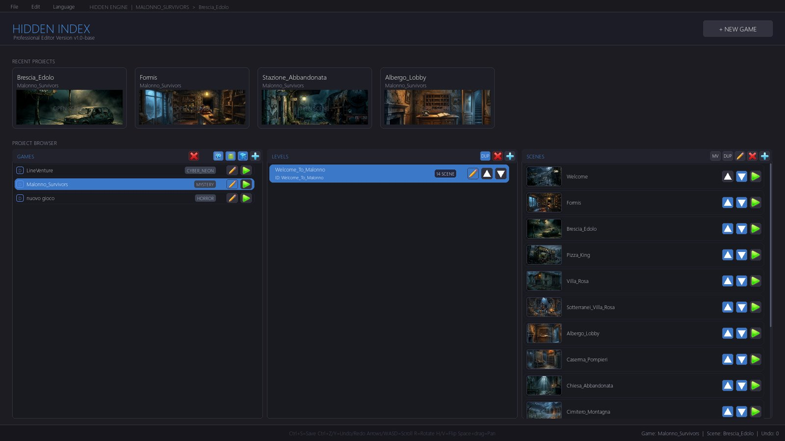 | 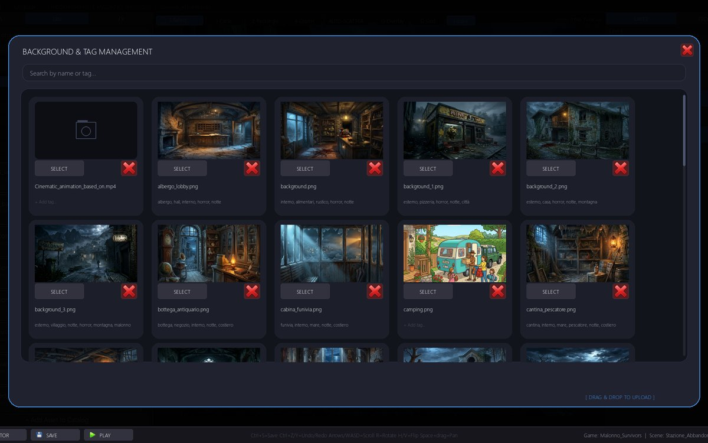 |
| **New game wizard** | **Music library** |
| 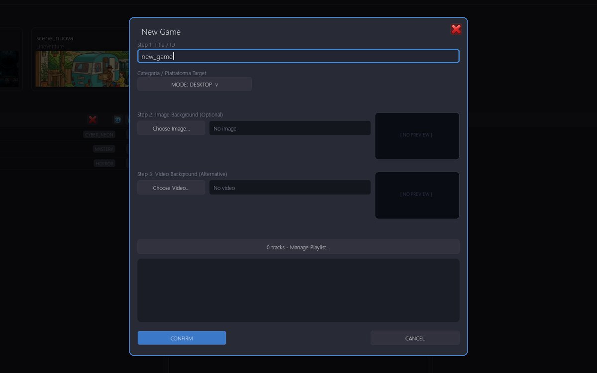 | 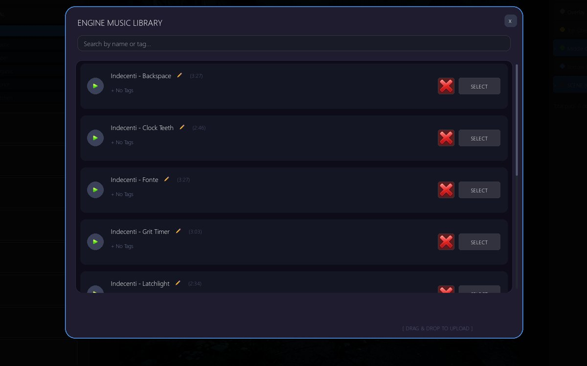 |

## One project, three targets

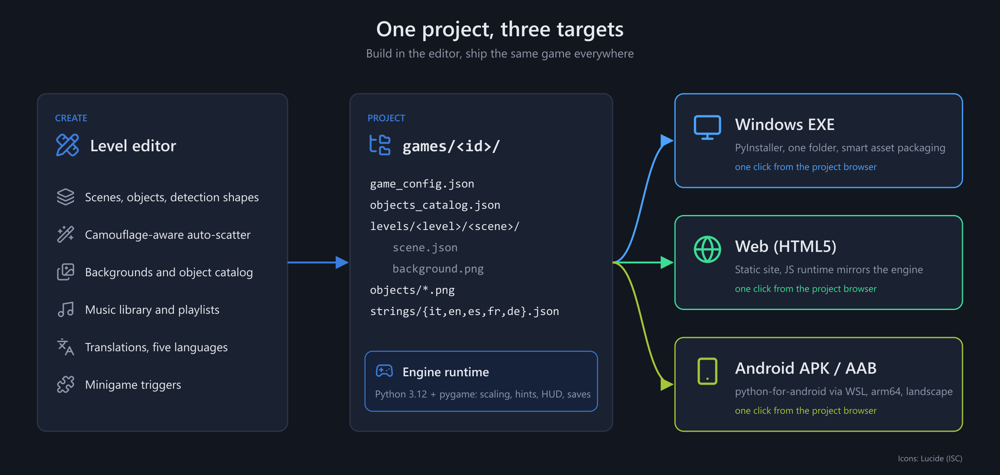

A game is a folder, `games/<id>/`, and all three builds start from that same folder. The
project browser has one button per target next to each game, and every build copies only
the assets the scenes actually reference (smart packaging), so bundles stay small.

###  Windows EXE

- **What you get** — a one-folder PyInstaller bundle in `dist/`: the engine, `main.py`, a
  ready `config.ini` and the game, nothing else. Typically 100-150 MB for a full game.
- **How** — the *Build EXE* button in the project browser. A progress window with a
  watchdog runs PyInstaller, then validates the bundle. The CI does the same for the editor
  itself (`HiddenEditor.spec`) and publishes it as a workflow artifact.
- **Docs** — [docs/build/](docs/build/).

###  Web (HTML5)

- **What you get** — a self-contained static site in `build_web/<id>/v<X.Y>/`: HTML, CSS,
  a JavaScript runtime and every asset copied or transcoded next to it. Builds are
  versioned, `index.html` redirects to the latest one, `builds.json` keeps the history.
- **How** — the *Export HTML* button, or from the command line:

  ```bash
  python -m editor.web_exporter Malonno_Survivors
  ```

  Open `build_web/Malonno_Survivors/index.html` with a double-click (it works from
  `file://`), run `avvia_server.bat` for a local server, or upload the folder to any static
  host: GitHub Pages, Netlify, itch.io.
- **Under the hood** — the JavaScript runtime does not wrap Python: it re-implements the
  engine's scaling, click detection, level flow, hints, effects, save games and minigames.
  Shared constants come from a single source (`editor/web_rules.py`) and the contract
  between the two runtimes is enforced by `pytest tests/test_web_sync.py`.
- **Docs** — [docs/web/WEB_EXPORT.md](docs/web/WEB_EXPORT.md),
  [docs/web/WEB_EXPORT_SYNC.md](docs/web/WEB_EXPORT_SYNC.md).

###  Android APK and AAB

- **What you get** — one APK per game (`--release` produces an AAB for the Play Store),
  arm64, minSdk 24 (Android 7+), landscape, pinch-to-zoom and pan on the scene. Asset
  pruning cut the LineVenture APK from 558 MB to 135 MB.
- **How** — the *Build APK* button, or from the command line:

  ```bash
  python editor/android_build_manager.py Malonno_Survivors 1.0 build/Malonno_Survivors/1.0
  ```

  The build runs buildozer and python-for-android inside **WSL2** (Ubuntu 24.04) with
  pygame-ce and NDK 28 (16 KB page alignment, required by Android 15+). Setup and helper
  scripts are in [scripts/](scripts/), starting with `setup_android_wsl.sh`.
- **Docs** — [docs/android/](docs/android/).

## Scenes and minigames

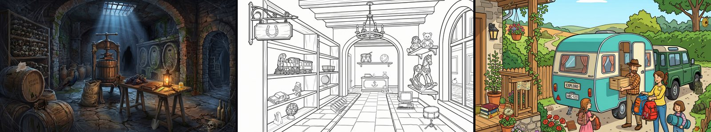

*One scene per art style: photoreal, line art, cartoon.* Two sample games are included:
**Malonno Survivors** (horror, 14 photoreal scenes) and **LineVenture** (line art and
cartoon, 3 scenes). Backgrounds and objects are AI-generated and refined with the editor
pipeline (cropping, background removal, cataloging).

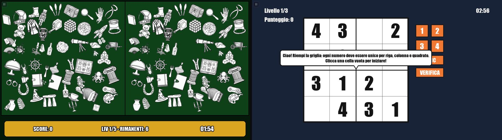

*Two of the nine bundled minigames: spot the differences on line-art assets, and sudoku
with its tutorial bubble.*

## How it works

A scene is `games/<game>/levels/<level>/<scene>/scene.json` plus a `background.png`.
Each object has a `catalog_id`, a position in the background's native pixel space and a
detection shape (`circle`, `rect`, `mask`). The `catalog_id` resolves against the merged
catalog: the shared one in `engine/data/` plus the game's own `objects_catalog.json`, which
wins on conflicts. The editor writes all of this; the runtime scales it to any screen.

| Path | What lives there |
|------|------------------|
| `engine/` | Game runtime: core loop, scene loader, catalog, HUD, scaling, hints, menus, minigames |
| `engine/assets/` | Shared backgrounds, objects, music, themes, engine strings |
| `editor/` | Level editor, desktop and Android build systems, web exporter and JS runtime |
| `games/<id>/` | One game: config, local catalog, levels, scenes, translations |
| `tools/` | Catalog audit, tag normalization, headless preview, MCP server |
| `tests/` | pytest suite, including the engine-to-web sync contract |

## Documentation

Full index in [docs/README.md](docs/README.md); useful entry points:

- [Coordinate system](docs/engine/COORDINATE_SYSTEM.md) and [hint system](docs/engine/HINT_SYSTEM.md)
- [Writing a minigame](docs/engine/MINIGAMES_DEVELOPMENT.md)
- [Web export](docs/web/WEB_EXPORT.md) and the [engine-to-web sync contract](docs/web/WEB_EXPORT_SYNC.md)
- [Android porting plan](docs/android/ANDROID_PORTING_PLAN.md) and [mobile UX audit](docs/android/ANDROID_MOBILE_UX_AUDIT.md)
- [Asset workflow](docs/assets/ASSETS_WORKFLOW.md) and [tag taxonomy](docs/assets/TAGS_TAXONOMY.md)
- [Roadmap](docs/ROADMAP.md)

## Contributing

The project is evolving and any contribution is welcome, big or small: a bug report, a
scene, a batch of objects, a translation, a minigame, a documentation fix, a feature.
Open an issue to discuss an idea, or a pull request if you already have the code.

Rules and setup in [CONTRIBUTING.md](CONTRIBUTING.md). Issues and pull requests can be in
English or Italian. Security issues: see [SECURITY.md](SECURITY.md), do not open a public
issue.

## License

**Free for noncommercial use, paid for commercial use.**

- **Code** — [PolyForm Noncommercial 1.0.0](LICENSE). Free to study, modify and ship in
  noncommercial projects: hobby games given away for free, education, research, charities
  and public institutions. Selling a game, monetizing it with ads or in-app purchases, or
  using the engine inside a company requires a **commercial license** from the author.
- **Assets** (images, music, sounds, README media) — [CC BY-NC 4.0](LICENSE-ASSETS.md):
  attribution, noncommercial. Commercial terms are agreed together with the code license.
- **Commercial license** — how to get one, and what counts as commercial, in
  [LICENSING.md](LICENSING.md). Short version: if the engine earns you money, the author
  gets a share.
- **History** — versions up to commit `354a140` (2026-09-04) were Apache 2.0 and stay
  available under those terms ([LICENSE-APACHE-2.0.txt](LICENSE-APACHE-2.0.txt)).
- **Third party** — fonts, pygame and other dependencies, Lucide icons in the diagram:
  [THIRD_PARTY_NOTICES.md](THIRD_PARTY_NOTICES.md). pygame is LGPL: distributed builds
  must ship its license text.
- **Name and logo** — "HiddenIndexEngine", "HIE" and the logos are trademarks of the
  author and are not covered by either license.

Copyright 2026 Indecenti.
